# Programming Foundations with JavaScript, HTML and CSS

[Course Link](https://www.coursera.org/learn/duke-programming-web?specialization=java-programming)

About this Course
>Learn foundational programming concepts (e.g., functions, for loops, conditional statements) and how to solve problems like a programmer. In addition, learn basic web development as you build web pages using HTML, CSS, JavaScript. By the end of the course, will create a web page where others can upload their images and apply image filters that you create.

This course is provided by Duke University

## After completing this course, you will be able to:
1. Think critically about how to solve a problem using programming;
2. Write JavaScript programs using functions, for loops, and conditional statements;
3. Use HTML to construct a web page with paragraphs, divs, images, links, and lists;
4. Add styles to a web page with CSS IDs and classes; and
5. Make a web page interactive with JavaScript commands like alert, onClick, onChange, adding input features like an image canvas, button, and slider.

## MiniProject: Image Filters on the Web
To make a simple website that allows you to filter different images. Some of you may have a smart phone. You may have seen apps like Snapchat or Instagram where you can upload images and create filters that make them look different. And now we're going to give you an opportunity to combine these skills and practices you have by making a website on Code Pen from scratch. And when you make that website, you're going to allow the user to upload an image.

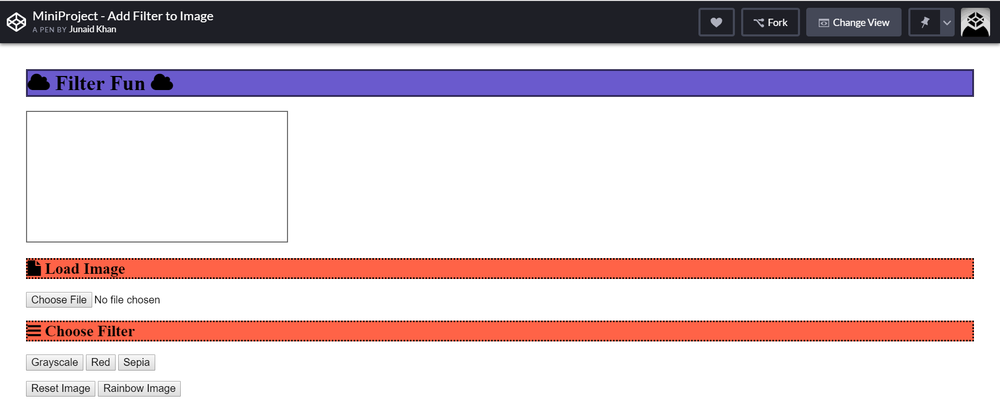

[Project Link](https://codepen.io/athos2113/full/bOovQw)

## (Optional) Honor's Content : Hiding Data in Images with Steganography

### Binary Numbers in Pixels
As you have learned, each pixel is represented as 3 components: a red value, a green value, and a blue value. Each of these can take a value from 0 to 255, inclusive—but this is 255 represented in base 10. Remember, to the computer, these are binary numbers. What is 255 represented in binary?

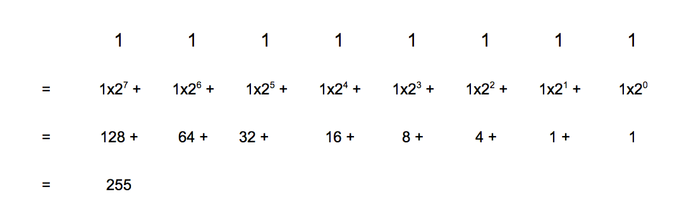

So when a pixel has the RGB values (255, 255, 255), to the computer that’s (1111 1111, 1111 1111, 1111 1111). Here are some more examples showing pixels’ RGB values in binary:

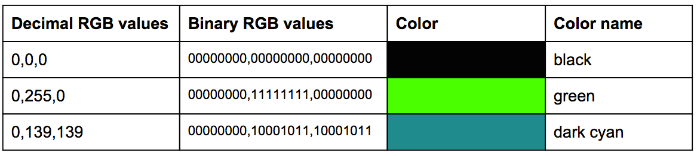

As you can see, each red, green, and blue value has 8 binary digits, which we call ‘bits’. This is why each value can be between 0 and 255: the smallest number represented in 8 binary digits is 0, and the largest is 1111 1111, which is 255 in base 10.

### Hiding Information in Pixels

So what does this mean for hiding one image inside another? You have seen in the videos on Hiding Data in Images: Steganography that you can hide one image inside another without affecting the original image much, and that to do this you clear the pixel values of the start and hide images. Now we will look in more detail at why this works.

You know that each pixel’s red, green, and blue values have 8 binary digits. In our start image, for each pixel, for each of its red, green, and blue values, we want to use 4 of these digits to hide information about another image in. (Note that we could use more or fewer than 4 digits to hide the second image in. We will talk about this more later in the course. For now, we will just use 4 digits to hide the image.) Which 4 digits should we use? We are going to put information about the hidden image in these digits, so we will lose the data about the start image in those digits. Which 4 digits are least important? Let’s look at an example. Say we have a pixel with the following red value:

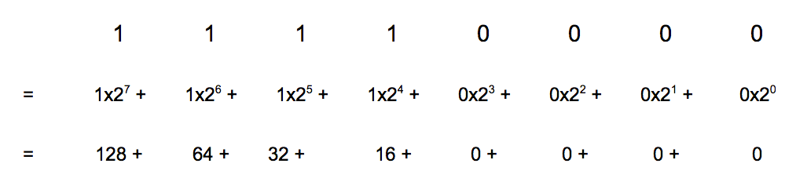

This is the number 240 in decimal. A pixel with a red value of 240 looks like this:

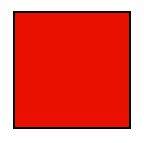

If we change the leftmost digit, a 1, to a 0, we are subtracting 128 (the binary digit is now 0111 0000). The new red value is 112 and looks like this:

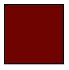

That’s a big difference, and we have only changed one digit! Imagine if we changed all 4 of the leftmost digits to end up with 0000 0000. Then we would have changed the original value by 240 (128+64+32+16) and the colour would be black. If we did this to every pixel in our image, it will change our original image significantly.

Now let’s imagine we change the rightmost 4 digits, to end up with 1111 1111, or 255 in decimal. We have changed the original value by 15 and it looks like this:

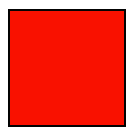

Not too different from the original:

The point of this example is to show that the leftmost 4 digits are the most important, or most significant. If you change them, you could change the value by up to 240. The rightmost 4 digits are the least important. If you change them, the most you could change the value by is 15. We want to leave the leftmost digits and use the rightmost 4 digits to hide our other image in. This way we won’t change our original image too much.

Which 4 digits of our hide image do we want to use? We only have 4 digits available in the start image, so we have to choose 4 digits from the hide image. We want to use the most important ones, so we use the leftmost 4. We need to store the leftmost 4 digits of our hide image inside the rightmost 4 digits of our start image. This is where the pixel clearing and shifting you saw in the video becomes necessary.

### Pixel Clearing
As you saw in the lecture video, let's look at an example of clearing space in pixels using base 10 first, then think about doing the same thing using binary. Let's imagine we have a value of 4781 in the start image combining with 5236 in the hide image to give the result 4752 in the final image.

To clear the rightmost 2 digits of a 4-digit decimal number, you divide and multiply by 100, or 10^2:

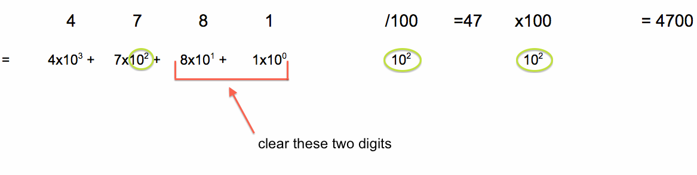

Let’s try to apply the same logic to an 8-digit binary number. We can’t use the value 4781 since the maximum value of an 8-digit binary number is 255 (1111 1111). Let’s use the binary number 1010 1010, or 170 in decimal.

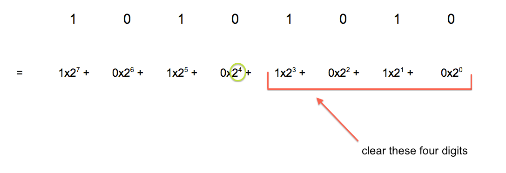

It looks like the analogous value to divide and multiply by is 2^4, or 16. This makes sense: to clear 2 digits in a base 10 number, we divided and multiplied by 10^2; to clear 4 digits in a base 2 number we divide and multiply by 2^4.

This means that if we divide the binary number 1010 1010 by the decimal number 16 we should get the binary number 1010 0000 (the left 4 digits are the same as in our original number, the right 4 digits are all 0s). Let’s check this by hand by doing the math in base 10. The binary number 1010 1010 is 170 in base 10. If we divide and then multiply 170 by 16 and then convert the answer to binary, we should get 1010 0000.

170 / 16 = 10

10 x 16 = 160

160 in binary:

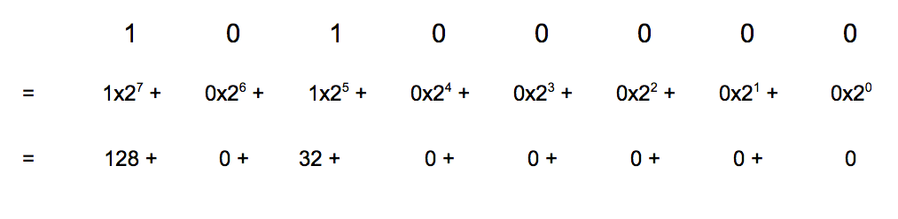

160 in binary is 1010 0000, which is what we expected.

You can also show that it works using code. We have written and run some JavaScript code to demonstrate this example. Below is the code and the output. You might find it helpful to run and play with the following code to help convince yourself that it works! Try doing some examples by hand as we did above and then running this code with those numbers.

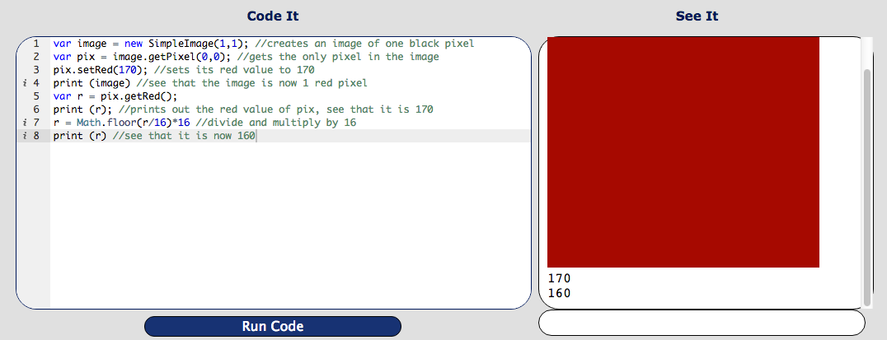

It is important to remember that although the computer is storing binary numbers, you are writing decimal numbers in your code and see decimal numbers printed out. This is why you divide and multiply by the decimal number 16 and not the binary number 10000 (if you wrote 10000 instead of 16, the program would assume you mean the decimal number ten thousand, rather than the binary representation of the number sixteen). You can actually do this assignment without knowing anything about binary numbers as long as you know that the number to divide and multiply by is 16. However, if you want to check that the pixel values are being transformed and combined correctly, it will be helpful to understand binary numbers. It is also helpful to understand binary numbers if later you want to change the number of bits to hide the image in.

Now we have seen why you divide and multiply by 16 to clear the rightmost 4 digits in an 8-digit binary number RGB value. This is what you will do to pixels in the start image. What about pixels in the hide image? For those we want to move the leftmost 4 digits to the rightmost 4 digits and make the leftmost 4 digits 0s. You saw that with a 4-digit decimal number you can divide by 100, or 10^2:

5236 / 100 = 52

This means that with an 8-digit binary number, you can divide by 16 (2^4). So if we divide the binary number 1010 1111 by 16 we should end up with the binary number 0000 1010.

Let’s check this by hand by doing the math in base 10. The binary number 1010 1111 is 175 in base 10. If we divide 175 by 16 and then convert the answer to binary, we should get 0000 1010.

175 / 16 = 10

10 in binary:

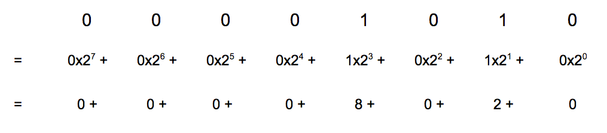
