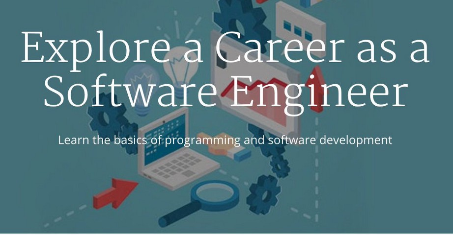
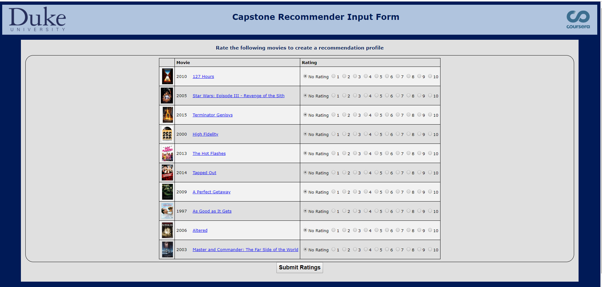
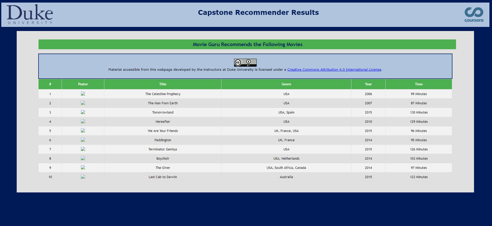
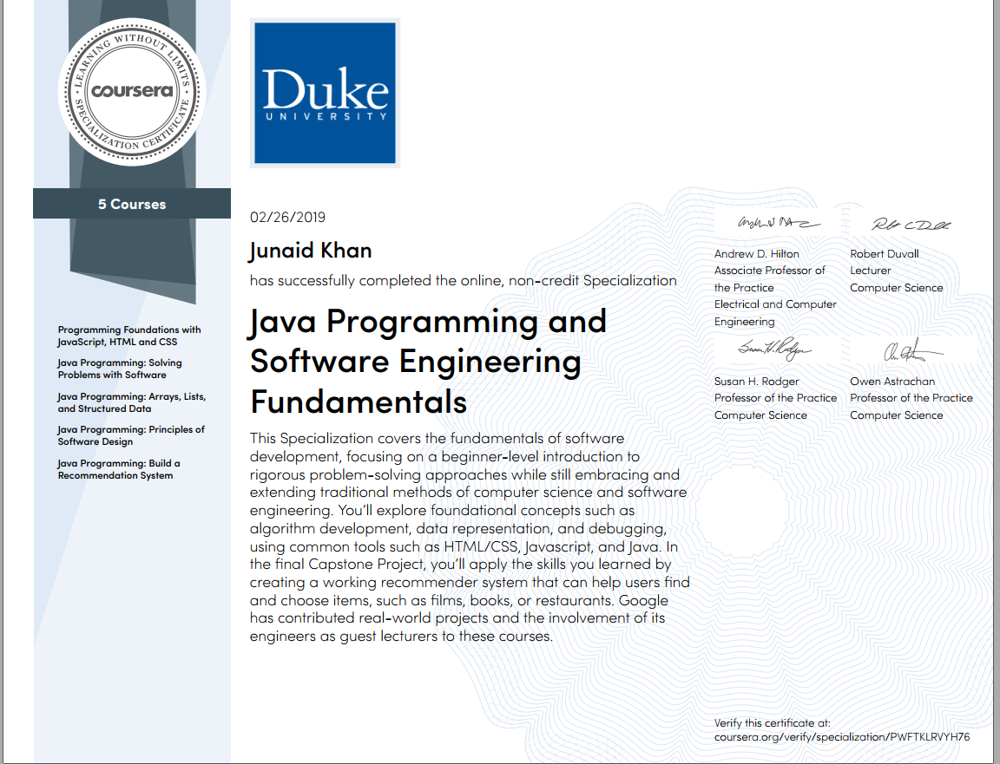

# Java Programming and Software Engineering Fundamentals Specialization

[Specialization Link](https://www.coursera.org/specializations/java-programming?)

>About this Specialization :
Take your first step towards a career in software development with this introduction to Java—one of the most in-demand programming languages and the foundation of the Android operating system. Designed for beginners, this Specialization will teach you core programming concepts and equip you to write programs to solve complex problems. In addition, you will gain the foundational skills a software engineer needs to solve real-world problems, from designing algorithms to testing and debugging your programs.

**OFFERED BY : DUKE UNIVERSITY

**SKILLS YOU WILL GAIN** :
1. Html
2. JavaScript
3. Cascading Style Sheets (CCS)
4. Java Programming

## There are 5 Courses in this Specialization

1. Programming Foundations with JavaScript, HTML and CSS
2. Java Programming: Solving Problems with Software
3. Java Programming: Arrays, Lists, and Structured Data
4. Java Programming: Principles of Software Design
5. Java Programming: Build a Recommendation System

## Capstone Project : MovieGuru : Movie Recommendation System
[Project Link](http://www.dukelearntoprogram.com/capstone/recommender.php?id=4lGpSCQxUMYbIR)

I Finished the specialization in 2 months.

